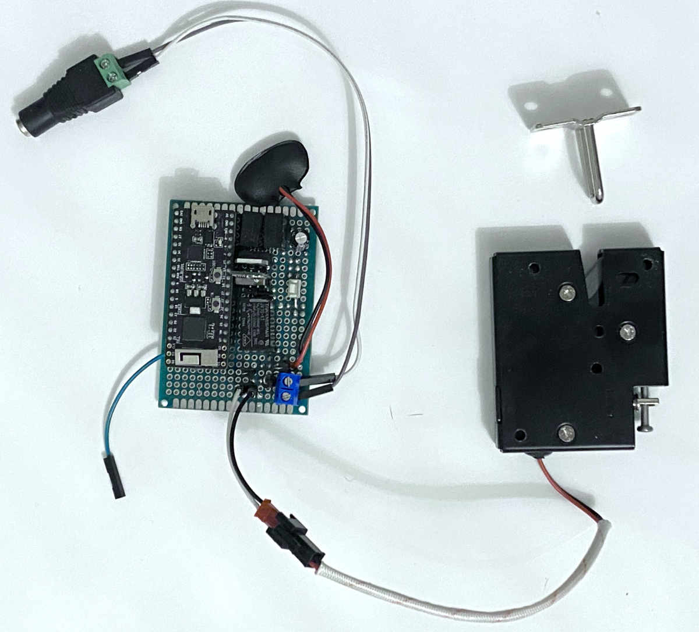

# POW (Proof of Work) Lock

> An experimental lock whose key gets "mined" like a Bitcoin block

## Physical Device

The physical portion of the device consists of an [electronic latch](https://www.amazon.com/gp/product/B01IB3OIVO) which is opened when a current is applied to its leads. The latch is connected to a WiFi-enabled [ESP32-PICO](https://www.amazon.com/gp/product/B07Q22SD4N) microcontroller running a lightweight TCP server, along with power conditioning and isolation circuitry, plus a relay to send power to the latch to open it.

## The Logic

The device has two states, "locked" and "unlocked". In the "unlocked" state, when an "open" message is transmitted over TCP to the device power is applied to the latch and it opens. However, in the "locked" state, the "open" message is ignored and the latch remains closed.

To transition from "unlocked" to "locked", a TCP message is sent to the device, along with a 256-bit "target", for example (in hexidecimal): `000000ffffff0000000000000000000000000000000000000000000000000000`.

The device replies with a 32-character random "base" string, for example: `0unpWSh9fqekFSa4XJqxP1zbHZvcF1aC`.

To transition the device back to the "unlock" state and open the latch, an 8-byte value must found such that the SHA-256 hash of the base+value is less than the target. This is similar to how a [Bitcoin gets mined](https://en.bitcoin.it/wiki/Hash).

## The Key

To interact with the device, I wrote a [companion app](https://github.com/rhinodavid/pow-key). This CLI can analyze the hashing rate of the computer its running on (optionally using multiple processes) and produce a target for you depending on how long you'd like the machine to take to find a solution. Given a base and a target, the app can then go hunt for a solution. Finally, it also handles the communication over TCP with the device.